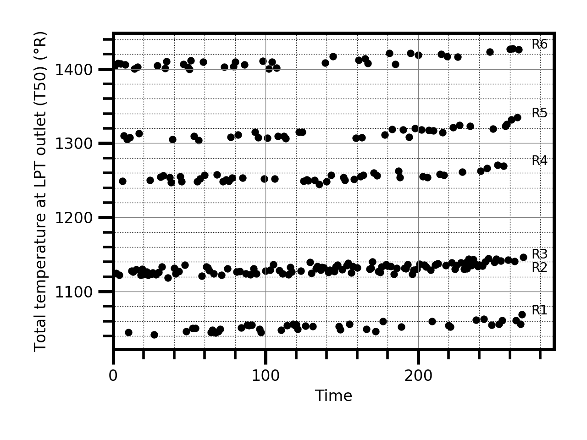
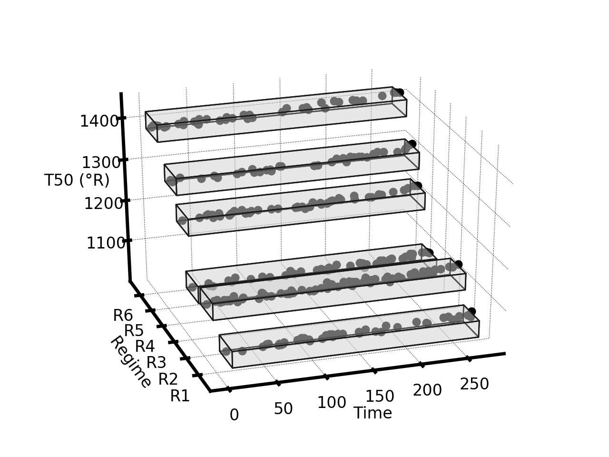
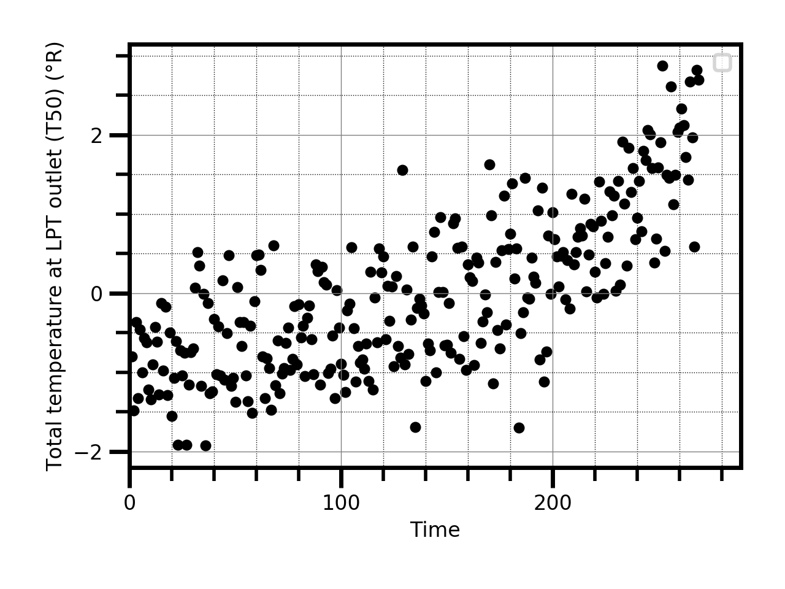

## Operating Regime Detection

Changing operational and environmental conditions pose significant challenges in many engineering tasks, including prognostics. In the presence of dynamic operating regimes, degradation can have distinct data profiles depending on the operational and environmental conditions. When these conditions are not factored out, it can be difficult to observe the deterioration path of the equipment. Therefore, it is useful to "baseline" the  data to focus on changes of system health. By baselining, we mean to eliminate the extra dimension of the data introduced by the dynamic conditions.

<p float="center">
  
   
  
</p>

This repository provides code to detect the regimes found in the data of C-MAPSS dataset 2 and 4 using a Self-Organizing Map (SOM) network. The method works without the need to explicitly state the number of operating modes/regimes.   

The basic usage is:
```
bmus_indexes, match_percentages = detect_regimes(dataset_id=2, dimension=20)
```

The `dataset_id` parameter indicates the dataset (2 or 4) of the C-MAPSS repository that you want to use. The parameter `dimension` allows defining the size of the network grid. 

The function `detect_regimes` returns a list of regimes for each data point as well as a list of matching rates for each observed engine unit. 

## C-MAPSS

The Commercial Modular Aero-Propulsion System Simulation (C-MAPSS) was developed at the NASA Glenn Research Center. The simulator emulates a large, high-bypass ratio turbofan engine similar to the GE90. The model is composed of several modules, as shown below. Six different flight conditions were simulated based on three operational conditions: altitude (0-42K ft.), Mach number (0-0.84), and throttle resolver angle (20-100). The throttle resolver angle, or TRA, is the angular deflection of the pilot’s power lever, varying between 0 and 100%. The Mach number is the ratio of flow velocity to the speed of sound at the medium. Altitude relates to atmospheric conditions.

 

The C-MAPSS data consists in a collection of time series of observables at cruise snapshots produced due to variation of the flow and efficiencies of the High Pressure Compressor (HPC) module from initial settings (nominal behavior) to failure values. Each degradation trajectory is characterized by series of observables (features) that include sensor and operational variables, that change over time from some nominal condition to failure. 

## Libraries Used

Python

- [Python Standard Library](https://docs.python.org/2/library/): Built in python modules.
- [Numpy](https://numpy.org/): Scientific computing with python.
- [Scikit-image](https://scikit-image.org/): Scientific image tools. 
- [Pandas](https://pandas.pydata.org/): Data analysis tools.
- [Scikit-learn](https://scikit-learn.org/stable/): Machine learning toolkit.
- [MiniSom](https://pypi.org/project/MiniSom/): Minisom package. 

### Note

The code was developed for C-MAPSS datasets but it can be easily adapted to other applications. 

### Support or Contact

Having trouble with this repository? Contact me and we’ll help you sort it out.
